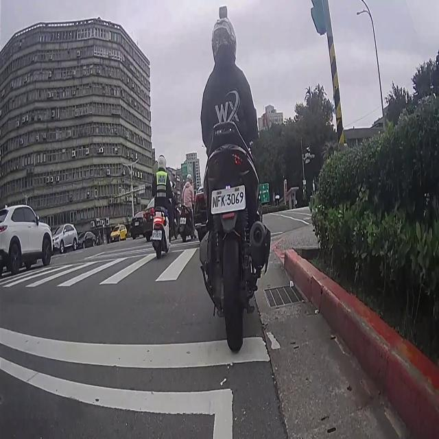
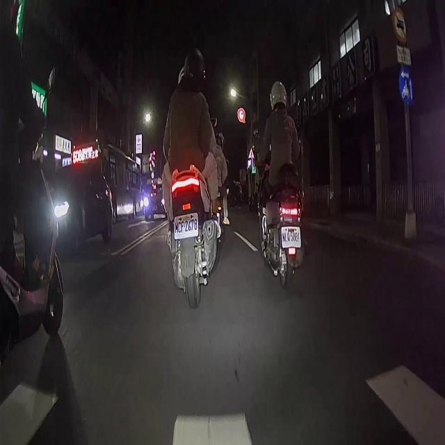

# 🚗 車輛偵測 (Vehicle Detection with YOLOv8)

[](https://www.python.org/) [](https://github.com/ultralytics/ultralytics) [](https://pytorch.org/)

本專案旨在使用 **YOLOv8** 模型進行訓練，專注於**行車紀錄器**場景下的物件辨識，能夠即時偵測公車、汽車與摩托車。

[TOC]

---

## 📹 成果展示 (Demo)

我們使用訓練好的模型對夜間道路影片進行推論，以下是實際運作結果：

[](https://www.youtube.com/watch?v=MRgN_CFv3r0)
> 點擊圖片觀看完整推論影片

### 實際場景截圖
本專案針對低光源、複雜光源（如霓虹燈、車燈）場景進行了優化。
| 場景 1 | 場景 2 |
| -------- | -------- |
|  <br> *(白天車流)* |  <br> *(夜晚車流)* |

---
## 🛠️ 環境建置 (Installation)

本專案基於 PyTorch 與 Ultralytics YOLOv8。建議使用 Conda 建立虛擬環境。

```bash
# 1. 建立虛擬環境 (建議 Python 3.10)
conda create -n jetbot_env python=3.10 -y
conda activate jetbot_env

# 2. 安裝 PyTorch (請依據您的 CUDA 版本調整)
pip install torch torchvision torchaudio

# 3. 安裝 YOLOv8
pip install ultralytics
```

## 📂 資料集 (Dataset)

資料集採用 YOLO 標準格式，包含 `train`, `val`, `test` 三個子集。
來源為 Roboflow 標註之夜間行車影像。

### 偵測類別 (Classes)
根據 `data.yaml` 設定，本模型支援以下 3 種路面常見車輛：
- `0`: **Bus (公車)**
- `1`: **Car (汽車)**
- `2`: **Motorcycle (摩托車)**

### 設定檔 (`data.yaml`)
```yaml
train: /home/rvl1421/embedding_system_jetbot/dataset/train/images
val: /home/rvl1421/embedding_system_jetbot/dataset/valid/images
test: /home/rvl1421/embedding_system_jetbot/dataset/test/images

nc: 3
names: ['bus', 'car', 'motorcycle']
```

## 🚀 模型訓練 (Training)

使用 `train.py` 進行模型訓練。我們選擇 `yolov8s.pt` (Small) 作為預訓練權重，在速度與精度間取得平衡。

### 執行訓練
```bash
python train.py
```
>:::success 訓練結果： 模型權重將儲存於 jetbot_project/run_vehicle_3classes/weights/best.pt。 :::


## 🎯 影像推論 (Inference)
訓練完成後，使用 `inference.py` 對影片進行自動標註與輸出。

### 執行推論
```bash
python python inference.py
```
>:::success 推論結果： 標注影片將儲存於 jetbot_project/video_result/檔名.avi。 :::

## 📁 專案結構 (Directory Structure)

```plaintext
embedding_system_jetbot/
├── dataset/                  # 訓練資料集
│   ├── train/
│   ├── valid/
│   ├── test/
│   └── data.yaml             # 資料集設定檔
├── jetbot_project/           # 訓練輸出與推論結果
│   ├── run_vehicle_3classes/ # 訓練 Log 與權重 (weights/)
│   └── video_result/         # 推論完成的影片
├── train.py                  # 訓練腳本
├── inference.py              # 推論腳本
└── README.md                 # 專案說明文件